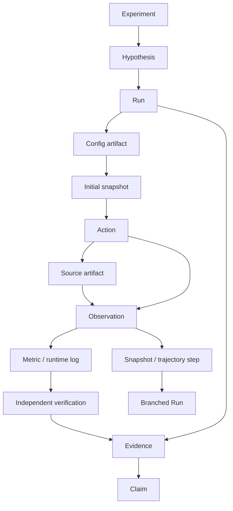

# Provenance DAG

The graph contains first-class Experiment, Hypothesis, Run, ActionEvent,
ObservationEvent, Artifact, Snapshot, VerificationResult, Evidence, Claim,
Trajectory and TrajectoryStep identities.



Edges follow data causality. Input source artifacts precede their consuming
observation; current workspace artifacts are linked to snapshots; snapshots precede
the next action. This makes code/config dependencies ancestors of final claims, not
merely unrelated sibling artifacts under a Run. Branches reference the selected
snapshot and source run, never edit original steps. Cross-run artifact versions use
explicit parent IDs when replacing an inherited file.

```python
ancestors = await runtime.get_ancestors(claim_id)
descendants = await runtime.get_descendants(hypothesis_id)
graph = await runtime.get_provenance(claim_id)
```

HTTP: `GET /objects/{id}/provenance` returns versioned nodes, edges, ancestors and
descendants. The query finds all paths to the chosen claim, including hypothesis,
run, code/config artifacts, producing observations and the independent verification.
Unrelated sibling runs are not implied to support the claim.

The ledger validates both endpoints, object scope and acyclicity before committing.
Canonical event payloads contain object revisions and the same provenance links as
the SQL index. UPDATE/DELETE/TRUNCATE triggers protect history. The current graph walk
is an in-process traversal over the index; large-graph query optimization is deferred.

Evidence authenticity here means that it was produced by the configured verifier
using the recorded run/artifact inputs. This does not automatically establish that
an arbitrary natural-language statement follows logically from the chosen metric.
That semantic binding belongs to explicit domain verification policies.
